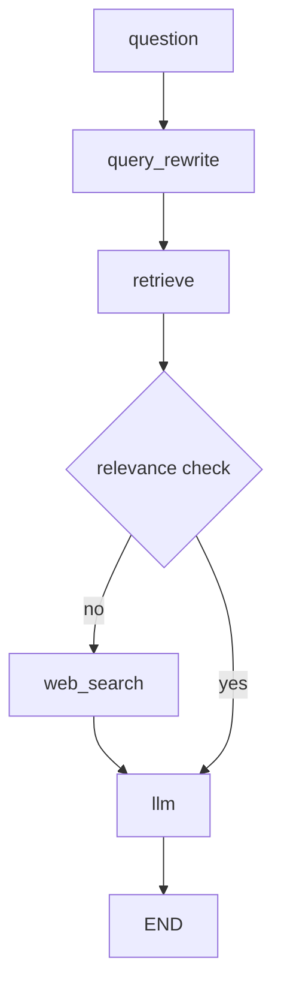

# Chapter 3. LangGraph 구조 설계

## 1. LangGraph로 자유롭개 그래프 로직 구성

- LangGraph의 그래프 정의 단계
  - State 정의
  - 노드 정의
  - 그래프 정의
  - 그래프 컴파일
  - 그래프 시각화

> 노드와 edge 구조를 가지면 유연하게 구조 설계가 가능함

## 2~5. RAG(전통적인 방식의 RAG)를 LangGraph로 구현

## 6. [프로젝트] Agentic RAG

## 7. [프로젝트] Adaptive RAG
