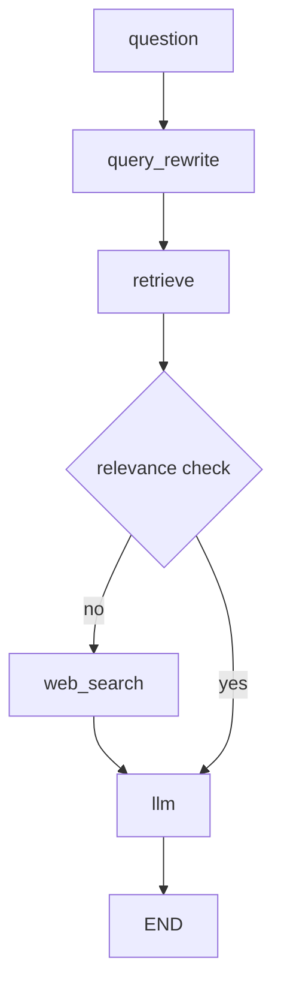
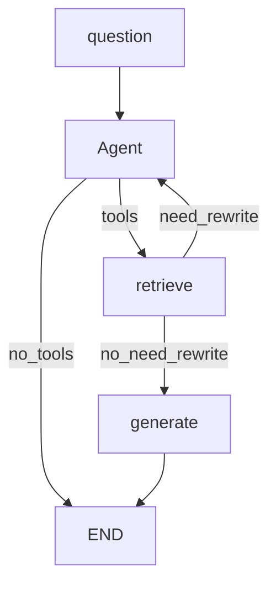
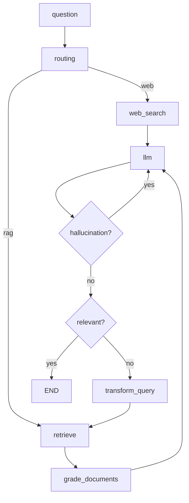

# Chapter 3. LangGraph 구조 설계

## 1. LangGraph로 자유롭개 그래프 로직 구성

- LangGraph의 그래프 정의 단계
  - State 정의
  - 노드 정의
  - 그래프 정의
  - 그래프 컴파일
  - 그래프 시각화

> 노드와 edge 구조를 가지면 유연하게 구조 설계가 가능함

## 2~5. RAG(전통적인 방식의 RAG)를 LangGraph로 구현

## 6. [프로젝트] Agentic RAG

- Agent를 쓰게 되면 RAG를 쓸지 말지 스스로 결정하게 된다는게 이점임
- 여기서 Agent는 retrieve_tool을 가지고 있음

## 7. [프로젝트] Adaptive RAG

- Adaptive RAG라는 논문을 참고한 튜토리얼
- 쿼리 분석과 Self-reflective RAG를 결합한 내용
- 쿼리 분석은 어떤 툴을 쓸지 고민하는 부분임
  - question을 보고 web 검색이 필요한지, RAG가 필요한지등을 분기하는 기법
- Self-reflective RAG란 자가 수정 RAG임
  - hallucination이나 relevant 체크를 하여 이전 노드로 돌아가는 기법

- 중간에 llm이 많이 들어가면서 퀄리티는 좋아지나, 답변이 나오기까지 시간이 오래걸림
- 요새는 이 문제를 ux적으로 풀려는 시도가 많음
  - 중간 과정을 표현한다거나, 더 기다리면 좋은 답변을 얻을 수 있다거나 해서 사용자가 기다리게 함
