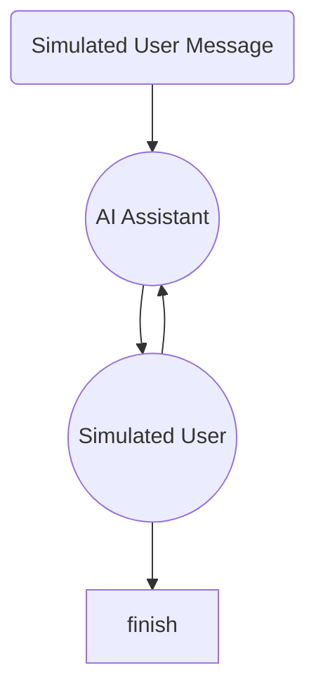
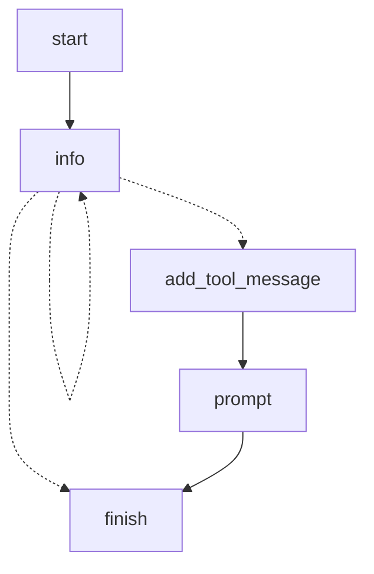
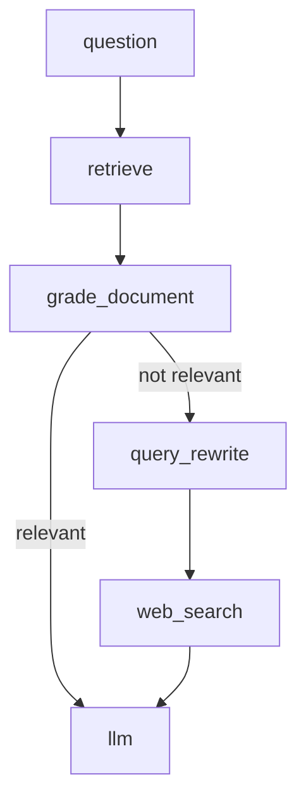

# Chapter 4. LangGraph Usecases

## 1. 에이전트간 대화 시뮬레이션

- 고객 응대 챗봇을 만들었을 때, 고객응대를 제대로 하는지 검증이 필요함
- 자가테스트 용도로 시나리오 테스트할 때 좋음
- 가상의 유저를 만들고 상황을 주어줘서 AI Assistant가 제대로 응대 하는지를 테스트함
- 동일한 메시지큐를 주고 받는 형태인데, llm이 두 개이다 보니 서로에게 넘겨줄 때, human과 ai 메시지 타입을 swap해야 상대방을 human처럼 인식함
- user의 답변이 FINISHED 이거나, 답변이 일정 개수가 넘어가면 종료하도록 함

## 2. 사용자 요구사항 기반 메타 프롬프트 생성 에이전트

- 메타 프롬프트 : 누군가 나 대신 프롬프트를 만들어주는 것, 일반적으로 llm을 통해 만드는 프롬프트를 의미함
- Information Gathering Agent : 에이전트에게 유저에게 받을 정보 목록을 추론없이 모두 받도록 loop를 돌게 함
- 이 예제 뿐만 아니라, 컨텍스트가 풍부하면 좋은 답변이 나오는데, 유저는 그걸 아직 인지하지 못하는 상황의 경우, 이 구조를 앞단에 배치하여 사용할 수 있음
- 메타 프롬프트 생성은 OpenAI 메타 프롬프트 가이드를 참조함
- 위 구조는 유저가 q를 누르면 end로 가는 구조라서 end로 바로 가는 edge가 있음

## 3. Corrective RAG

- Adaptive RAG와의 차이는 문서중에서 관련성이 높은 애들의 개수의 threshold를 정해 모자라면 추가 정보를 얻는 형태
