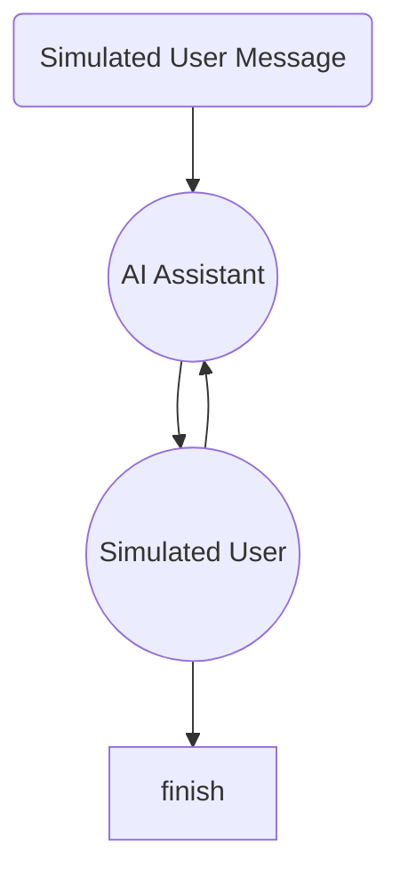
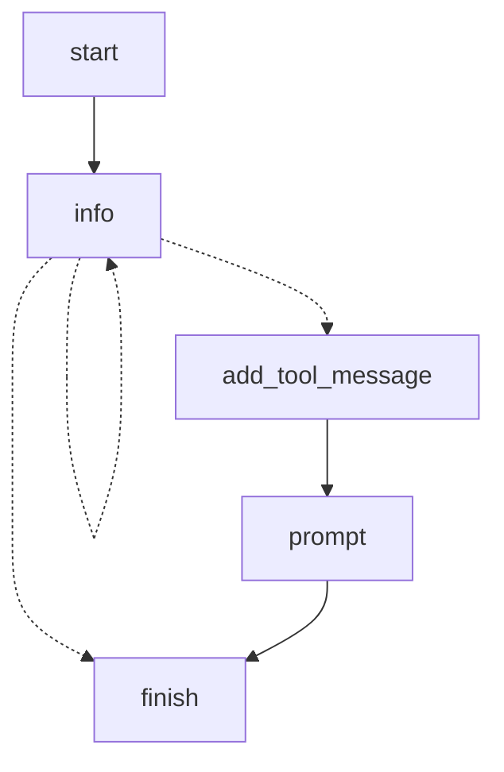
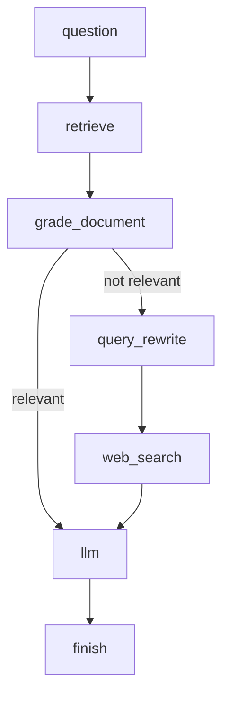
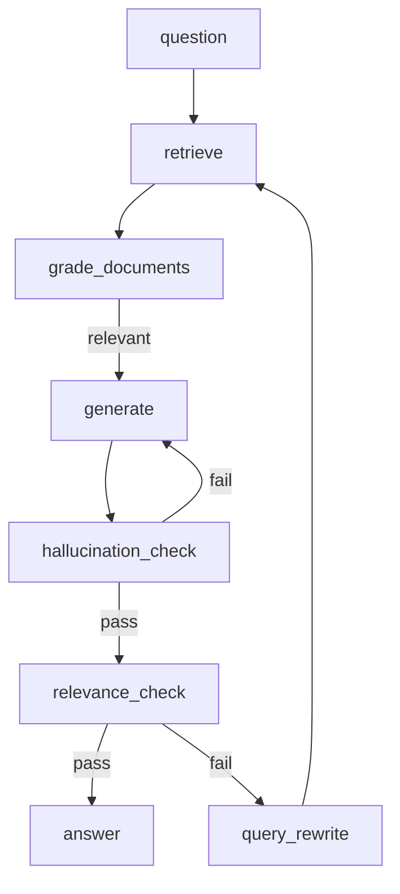
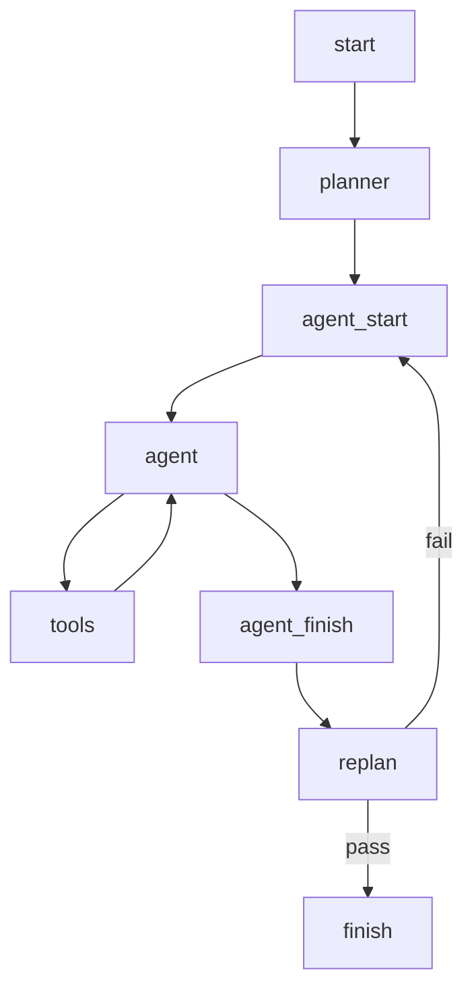

# Chapter 4. LangGraph Usecases

- 노드와 엣지간 그래프 설계는 AI를 통해서 할 수 있을 듯
- 어떤식으로 사용하는지만 확인하자

## 1. 에이전트간 대화 시뮬레이션

- 고객 응대 챗봇을 만들었을 때, 고객응대를 제대로 하는지 검증이 필요함
- 자가테스트 용도로 시나리오 테스트할 때 좋음
- 가상의 유저를 만들고 상황을 주어줘서 AI Assistant가 제대로 응대 하는지를 테스트함
- 동일한 메시지큐를 주고 받는 형태인데, llm이 두 개이다 보니 서로에게 넘겨줄 때, human과 ai 메시지 타입을 swap해야 상대방을 human처럼 인식함
- user의 답변이 FINISHED 이거나, 답변이 일정 개수가 넘어가면 종료하도록 함

## 2. 사용자 요구사항 기반 메타 프롬프트 생성 에이전트

- 메타 프롬프트 : 누군가 나 대신 프롬프트를 만들어주는 것, 일반적으로 llm을 통해 만드는 프롬프트를 의미함
- Information Gathering Agent : 에이전트에게 유저에게 받을 정보 목록을 추론없이 모두 받도록 loop를 돌게 함
- 이 예제 뿐만 아니라, 컨텍스트가 풍부하면 좋은 답변이 나오는데, 유저는 그걸 아직 인지하지 못하는 상황의 경우, 이 구조를 앞단에 배치하여 사용할 수 있음
- 메타 프롬프트 생성은 OpenAI 메타 프롬프트 가이드를 참조함
- 위 구조는 유저가 q를 누르면 end로 가는 구조라서 end로 바로 가는 edge가 있음

## 3. Corrective RAG

- Adaptive RAG와의 차이는 문서중에서 관련성이 높은 애들의 개수의 threshold를 정해 모자라면 추가 정보를 얻는 형태

## 4. Self-RAG

- Adaptive RAG와 비슷함.
- 자기 반성 및 자기 평가를 포함한 RAG 전략을 Self-RAG라고 함
- RAG 전략은 최신 전략이 달라지모로 최신 경향을 확인해보는 것이 좋음

## 5. Plan and Execute

- plan and execute : 어떤 작업을 할 때, 계획을 세우고 실행하는 것
- 복잡한 태스크를 보고 planner가 계획 목록을 세움
- 그걸 agent가 하나씩 툴을 이용해서 수행
- replan 에서 실행 결과를 확인하여 다시 계획을 세우거나 마침

## 6. 멀티 에이전트 협업 - 웹 검색 및 차트 생성

- 에이전트를 하나 이상 둬서 서로 핑퐁치도록함
- 예) 연구 담당 에이전트, 차트 담당 에이전트을 나누어서 한 명은 질문에 해당하는 데이터를 뽑아내고, 한 명은 데이터를 기반으로 차트를 그림
- 에이전트를 역할 분담을 하게 되면 전문성이 높아지고 일을 잘할 수 있게됨

## 7. Supervisor를 추가한 멀티 에이전트

- 지시사항을 supervisor에게 주면, supervisor가 각 에이전어를 컨트롤하는 형태
- supervisor 이점 : 에이전트가 여러개 있으면 한 명은 start가 되어야하는데, 그럼 유연성이 떨어짐. supervisor가 entry point가 되면 각 에이전트를 상황에 따라 사용가능함
- 많은 에이전트를 컨트롤 하는 구조에서는 보통 supervisor 에이전트를 사용함

## 8. 계층적인 구조를 가지는 멀티 에이전트 팀

- 여러 에이전트를 묶어 팀 단위로 만들고 팀을 관리하는 중간 관리자(supervisor)를 두고, 각 팀들을 총괄하는 총 관리자(supervisor)를 두는 구조
- 계층적인 팀을 만드는 이점 : 팀들을 잘 융합해서 복잡한 태스크를 더 잘 수행할 수 있음, 팀들이 여러개 생겼을 때, 팀끼리 소통하는 구조가 아니라 총 supervisor 통해 소통하여 구조를 단순하고 유연하게 가져갈 수 있음

## 9. SQL 에이전트

- SQL 데이터 베이스와 상호작용하는 에이전트를 만들어보자
- SQL 데이터 베이스와 RAG 시스템을 융합하는 경우가 있음
- 보통 복잡한 테이블 구조 때문에 제대로된 정보를 가져오지 못하는 경우가 있는데, 테이블과 스키마 정보를 참고하도록 만들어서 정확도 높은 SQL 쿼리문을 만들도록 함

## 10. Research 특화

- STORM이라는 논문을 기반으로, 유사한 주제 조회와 다양한 관점의 대화 시뮬레이션을 통해 참고 출처 사용 빈도와 정보 밀도를 증가 시킴

## 11~12. GitHub 소스코드 기반 QA 챗봇 구현

- 문서 DB 화
  - 다운로드받은 소스코드를 loader를 이용해 Documents 객체로 변환
  - Documents을 Split
  - Split 한 결과를 embedding 하고 벡터 DB에 저장
- 기존과 비슷함 chain을 구성함
  - 한글 질문은 유사도가 떨어질 수 있어서 query_rewrite를 무조건 통과하게 하면 좀 더 정밀하게 제어 가능
  - 문서에서 정보가 부족할 경우, 웹검색을 할 수 있도록 웹검색툴도 추가

## Perplexity 클론 앱 구현

- perplexity : llm에 원래는 웹검색이 없는데, 필요한 경우 웹검색을 함
